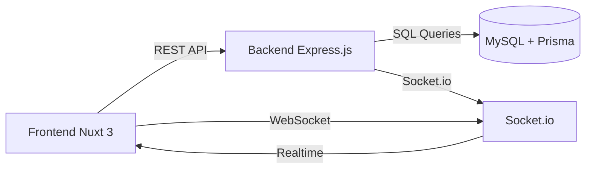
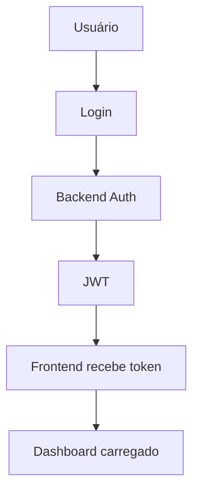
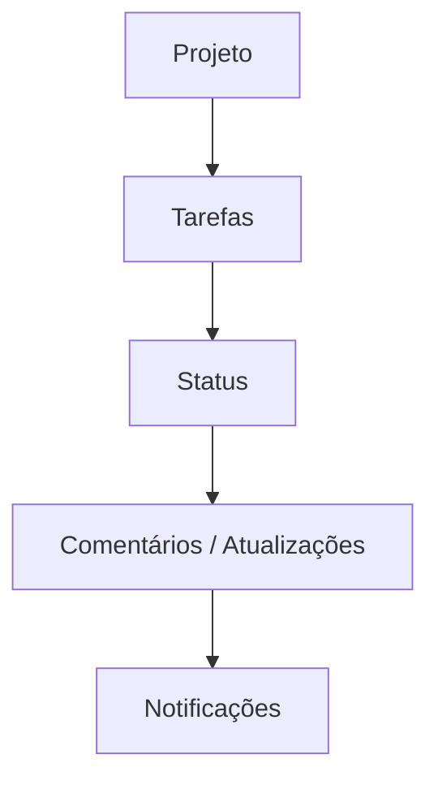
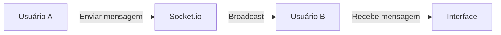
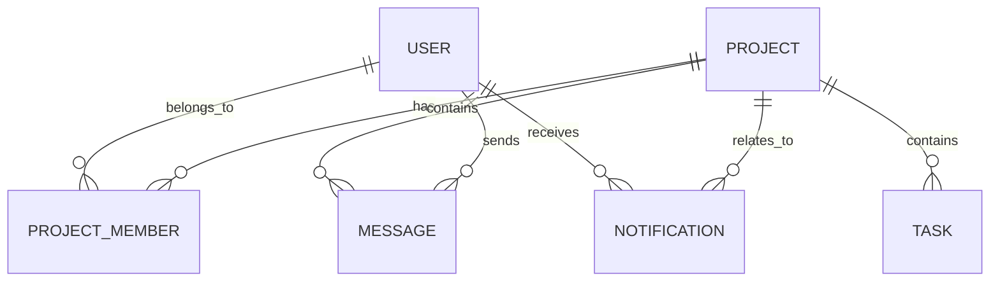

# Documentação Visual do Projeto

## 1. Visão Geral

Este projeto é uma plataforma de colaboração para equipes, unindo:
- gestão de projetos
- tarefas e estados
- chat em tempo real
- notificações
- dashboard de métricas

### Principais peças

- Frontend: Nuxt 3 + Vue 3 + TypeScript + Tailwind CSS
- Backend: Express.js + Socket.io
- Banco: MySQL + Prisma

---

## 2. Arquitetura Visual

### Explicação
- O frontend consome a API REST para todas as rotas de CRUD.
- O backend utiliza Prisma para acessar o MySQL.
- O Socket.io fica no backend e envia eventos em tempo real ao frontend.

---

## 3. Fluxos de Uso

### 3.1 Fluxo de login

### 3.2 Fluxo de projeto e tarefa

### 3.3 Fluxo de chat em tempo real

---

## 4. Módulos do Sistema

### 4.1 Autenticação

- Cadastro de usuários
- Login com JWT
- Recuperação de senha opcional
- Papéis e permissões

### 4.2 Projetos e Equipes

- CRUD de projetos
- Membros atribuídos ao projeto
- Convites e permissões

### 4.3 Tarefas

- Tarefas dentro de projeto
- Estados: pendente, em andamento, concluída
- Comentários e anexos

### 4.4 Chat em Tempo Real

- Sala de chat por projeto
- Envio e recebimento instantâneo
- Indicador online/offline

### 4.5 Notificações

- Notificações em tempo real no frontend
- Atualizações de tarefas e chat
- Lista de notificações persistente

### 4.6 Dashboard

- Visão geral de projeto e tarefas
- Métricas de atividade
- Histórico de ações

---

## 5. Diagrama de Dados Simplificado

### Entidades-chave
- User
- Project
- Task
- Message
- Notification
- ProjectMember

---

## 6. Estrutura de Telas

### Telas principais

- Login / Registro
- Dashboard
- Lista de projetos
- Detalhe de projeto
- Detalhe de tarefa
- Chat por projeto
- Perfil do usuário
- Administração

### Layout visual

- Barra lateral de navegação
- Área principal com cards e listas
- Header com notificações e perfil
